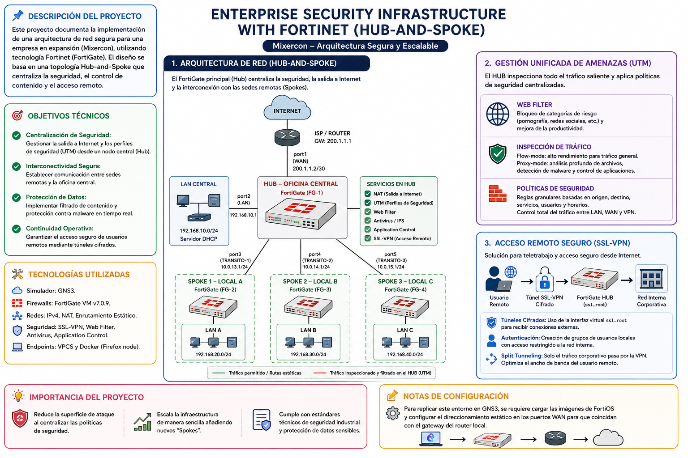
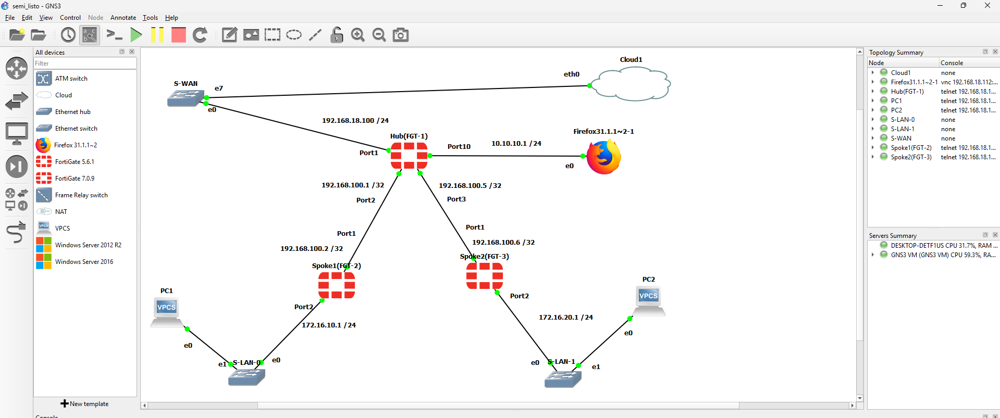
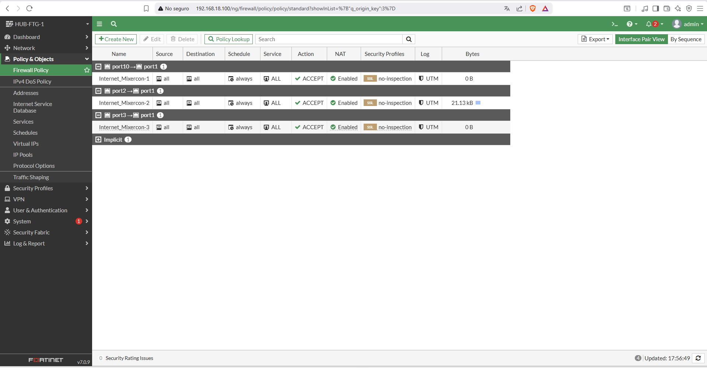
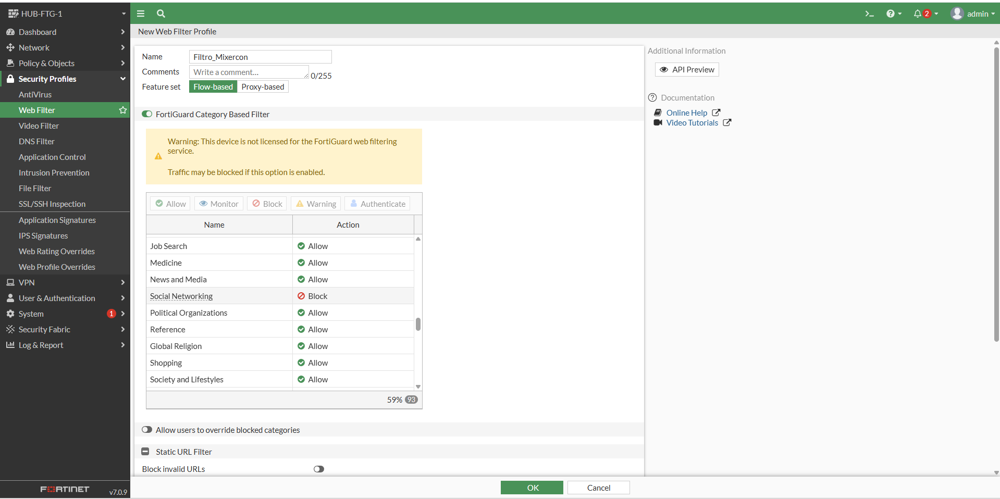
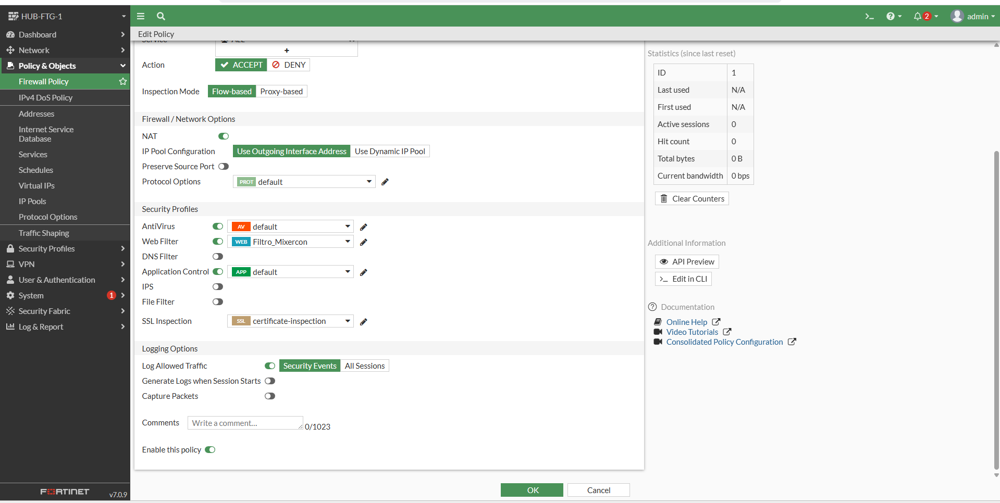

# 🛡️ Seguridad Perimetral y Conectividad con FortiGate — Mixercon

> Implementación de un sistema de defensa perimetral centralizado con arquitectura **Hub-and-Spoke**, gestión unificada de amenazas (UTM) y acceso remoto seguro mediante VPN SSL, simulado en GNS3 con dispositivos **FortiGate VM (FortiOS 7.x)**.

---

## 📌 Índice

1. [Contexto del Proyecto](#-contexto-del-proyecto)
2. [Topología de Red](#-topología-de-red)
3. [Direccionamiento IP](#-direccionamiento-ip)
4. [Conectividad y NAT](#-conectividad-y-nat)
5. [Perfiles UTM — Filtrado y Control](#-perfiles-utm--filtrado-y-control)
6. [VPN SSL — Acceso Remoto Seguro](#-vpn-ssl--acceso-remoto-seguro)
7. [Modos de Inspección](#-modos-de-inspección)
8. [Resultados](#-resultados)
9. [Tecnologías Utilizadas](#-tecnologías-utilizadas)
10. [Scripts de Configuración](#-scripts-de-configuración)

---

## 🏢 Contexto del Proyecto

**Mixercon** es una empresa del sector construcción con sede central y dos sucursales remotas. Su red carecía de controles de seguridad unificados, exponiendo la operación a riesgos de intrusión, fuga de datos y pérdida de continuidad operativa.

La solución propuesta centraliza la seguridad mediante firewalls de próxima generación **FortiGate (NGFW)** bajo una arquitectura **Hub-and-Spoke**, donde:

- Todo el tráfico de las sucursales es inspeccionado en el HUB central antes de salir a Internet.
- Las políticas UTM se aplican de forma unificada desde un único punto.
- Los trabajadores remotos acceden de forma cifrada mediante VPN SSL.

El entorno fue diseñado, configurado y validado íntegramente en **GNS3**, replicando fielmente la infraestructura real de la empresa.

---

## 🗺️ Topología de Red

El siguiente esquema muestra la arquitectura general de la solución implementada y cómo fue representada en GNS3:

| Vista General | Topología en GNS3 |
|:---:|:---:|
|  |  |

### Distribución de equipos

| Rol | Dispositivo | Función Principal |
|---|---|---|
| **HUB** | FortiGate FGT-1 | Núcleo de seguridad. Salida a Internet, UTM, VPN SSL y enrutamiento central. |
| **SPOKE 1** | FortiGate FGT-2 | Sucursal A. Conectada al HUB para acceso a Internet y recursos internos. |
| **SPOKE 2** | FortiGate FGT-3 | Sucursal B. Mismo modelo de funcionamiento centralizado. |

---

## 📡 Direccionamiento IP

### Red WAN — Salida a Internet (solo en HUB)

| Interfaz | Dirección IP | Función |
|---|---|---|
| `Port1` | `192.168.18.100/24` | Salida a Internet (FGT-1) |
| **Gateway** | `192.168.18.1` | Router principal de la red |

### Redes LAN por sede

| Dispositivo | Interfaz | Dirección IP | Red |
|---|---|---|---|
| HUB (FGT-1) | `Port10` | `10.10.10.1/24` | LAN Sede Central |
| SPOKE 1 (FGT-2) | `Port2` | `172.16.10.1/24` | LAN Sucursal A |
| SPOKE 2 (FGT-3) | `Port2` | `172.16.20.1/24` | LAN Sucursal B |

### Enlaces de tránsito HUB ↔ SPOKEs

| Enlace | Dispositivo | Interfaz | IP |
|---|---|---|---|
| HUB → SPOKE 1 | FGT-1 | `Port2` | `192.168.100.1` |
| | FGT-2 | `Port1` | `192.168.100.2` |
| HUB → SPOKE 2 | FGT-1 | `Port3` | `192.168.100.5` |
| | FGT-3 | `Port1` | `192.168.100.6` |

---

## 🌐 Conectividad y NAT

La salida a Internet fue implementada exclusivamente en el **HUB (FGT-1)**, garantizando que todo el tráfico de las sucursales sea canalizado y analizado antes de alcanzar Internet.

### Configuración de la interfaz WAN

```bash
config system interface
    edit port1
        set mode static
        set ip 192.168.18.100 255.255.255.0
        set allowaccess ping https ssh
    next
end
```

### Ruta por defecto hacia Internet

```bash
config router static
    edit 1
        set gateway 192.168.18.1
        set device port1
    next
end
```

Las capturas siguientes muestran la configuración de interfaces de red y la creación de las políticas de NAT que permiten la salida centralizada:

<table>
  <tr>
    <td align="center"><br/><sub>Interfaces de red configuradas</sub></td>
    <td align="center"><br/><sub>Verificación de conectividad</sub></td>
  </tr>
</table>

### Configuración de rutas estáticas y parámetros de red

<table>
  <tr>
    <td align="center"><br/><sub>Rutas estáticas — Vista 1</sub></td>
    <td align="center"><br/><sub>Rutas estáticas — Vista 2</sub></td>
    <td align="center"><br/><sub>Rutas estáticas — Vista 3</sub></td>
  </tr>
</table>

### Políticas de NAT

Se implementaron políticas de Firewall con NAT habilitado para permitir que los dispositivos de las sucursales naveguen a través de la IP pública del HUB.



---

## 🔒 Perfiles UTM — Filtrado y Control

Con la conectividad establecida, se configuraron los **Security Profiles** de FortiGate para inspeccionar el tráfico en tiempo real y proteger la red corporativa ante amenazas modernas.

Toda la inspección fue centralizada en el HUB, lo que simplifica la administración, supervisión y actualización de políticas en todas las sedes.

### Filtrado Web — Bloqueo de Redes Sociales

Se configuraron filtros de navegación para restringir el acceso a sitios de riesgo, páginas no autorizadas y redes sociales, reduciendo la exposición a phishing y optimizando el ancho de banda.



**Beneficios implementados:**
- ✅ Bloqueo de categorías maliciosas y sitios de phishing.
- ✅ Restricción de redes sociales en horario laboral.
- ✅ Reducción del consumo de ancho de banda no productivo.

### Política de Navegación — Control de Aplicaciones

Se implementó **Application Control** para identificar, monitorear y restringir las aplicaciones en uso dentro de la red, incluyendo software P2P y aplicaciones no corporativas.



**Capacidades habilitadas:**
- ✅ Detección de aplicaciones potencialmente peligrosas.
- ✅ Limitación del tráfico no autorizado.
- ✅ Monitoreo de aplicaciones en tiempo real.
- ✅ Generación de reportes de uso por sede.

---

## 🔐 VPN SSL — Acceso Remoto Seguro

Para cubrir la necesidad de teletrabajo seguro, se implementó una **VPN SSL** en el FortiGate HUB. Esta solución permite que colaboradores remotos se conecten de forma cifrada a la red interna de Mixercon desde cualquier ubicación.

### Características de la configuración

- **Interfaz virtual:** `ssl.root`
- **Modo de tunelización:** Split Tunneling (solo el tráfico corporativo pasa por el túnel)
- **Autenticación:** Grupos de usuarios locales con políticas de acceso específicas
- **Política Firewall:** Control granular del tráfico desde `ssl.root` hacia la LAN del HUB

**Ventajas del diseño:**
- ✅ Cifrado del tráfico corporativo extremo a extremo.
- ✅ Menor latencia gracias al Split Tunneling (el tráfico de Internet no pasa por el túnel).
- ✅ Control de acceso por usuario y grupo.
- ✅ Compatible con el cliente **FortiClient**.

### Capturas de la implementación VPN SSL

<table>
  <tr>
    <td align="center"><br/><sub>Portal VPN SSL — Configuración general</sub></td>
    <td align="center"><br/><sub>Grupos de usuarios y autenticación</sub></td>
    <td align="center"><br/><sub>Política Firewall para tráfico SSL VPN</sub></td>
  </tr>
</table>

---

## ⚙️ Modos de Inspección

FortiGate ofrece dos modos de inspección de tráfico. Se analizaron ambos y se seleccionó el más adecuado para el contexto de Mixercon:

| Característica | 🔵 Flow-Based | 🟠 Proxy-Based |
|---|:---:|:---:|
| Velocidad de inspección | ⚡ Alta | 🐢 Moderada |
| Consumo de recursos | Bajo | Alto |
| Profundidad de análisis | Estándar | Profunda |
| Inspección de contenido completo | No | Sí |
| Ideal para | Alto rendimiento | Máxima seguridad |

### Decisión de diseño

> **Se adoptó el modo Flow-Based** como estándar en todas las políticas principales. Mixercon requiere mantener el rendimiento de red sin afectar la productividad de sus sedes, y el modo Flow permite inspección en tiempo real con mínimo impacto en la latencia. El modo Proxy queda reservado para políticas de alta criticidad donde se requiera análisis exhaustivo de contenido.

---

## 📊 Resultados

La implementación logró cumplir todos los requerimientos de seguridad planteados por Mixercon:

| Objetivo | Estado |
|---|:---:|
| Centralización de la seguridad perimetral | ✅ Completado |
| Salida a Internet administrada exclusivamente desde el HUB | ✅ Completado |
| Segmentación IP correcta por sede | ✅ Completado |
| Protección UTM con Filtrado Web y Control de Aplicaciones | ✅ Completado |
| Implementación de VPN SSL con Split Tunneling | ✅ Completado |
| Monitoreo y control centralizado del tráfico | ✅ Completado |
| Escalabilidad para nuevas sucursales | ✅ Diseño preparado |

La infraestructura diseñada transforma una red distribuida y sin controles unificados en una arquitectura **segura, centralizada y escalable**, preparada para el crecimiento futuro de la empresa.

---

## 🛠️ Tecnologías Utilizadas

| Tecnología | Descripción |
|---|---|
| **FortiOS 7.x** | Sistema operativo de los firewalls FortiGate VM |
| **GNS3** | Plataforma de simulación de redes |
| **Cisco Switch L2** | Simulación de segmentos WAN/LAN |
| **Docker (WebTerm)** | Contenedores para pruebas de navegación web |
| **FortiClient** | Cliente VPN SSL para acceso remoto |

---

## 📁 Scripts de Configuración

Los archivos de configuración exportados desde los dispositivos FortiGate se encuentran en la carpeta [`/scripts`](scripts/):

| Archivo | Descripción |
|---|---|
| [`hub-config.txt`](scripts/hub-config.txt) | Configuración completa del FortiGate HUB (FGT-1) |
| [`spoke-configs.txt`](scripts/spoke-configs.txt) | Configuración de los SPOKEs (FGT-2 y FGT-3) |

---

<div align="center">

**Proyecto desarrollado con fines de diseño de arquitectura y validación de seguridad en entornos controlados.**


</div>